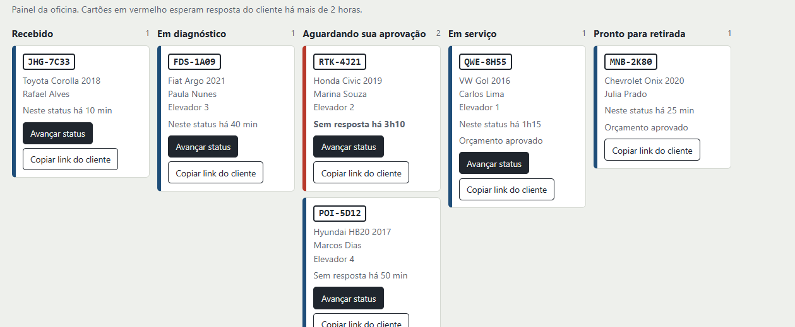

# Auto Center Veloz 

Web app(link): o cliente acompanha o conserto e aprova o orçamento pelo celular, mais rápido sem aplicativo externo.

Projeto da disciplina Design Profissional, Prof. Sedenilso Antonio Machado.

`https://github.com/GABRIELSELIS/autocenter-veloz`

## 1. Briefing

A Auto Center Veloz tem ótima reputação, mas depende de orçamento em papel.

- recepcionistas muito atarefados por conta de mensagens de clientes (status, fotos de peças);
- mecânicos interrompem o trabalho para responder;
- clientes levam horas aprovando orçamentos;


**Oportunidade:** unir a confiança técnica da oficina com a transparência digital das concessionárias, sem o preço delas.

## 2. Solução e justificativa (web app)

- **Cliente não instala app.** Um link enviado por WhatsApp abre em qualquer celular.
- **Site institucional não resolve a dor**, que é operacional (status e aprovação).
- **Um painel interno** dá à recepção e aos mecânicos uma visão única do pátio e acaba com as ligações internas.
- **Baixo** custo de manutenção.

| Dor | Resposta no sistema |
|---|---|
| "Meu carro já está pronto?" | Linha do tempo em tempo real no link do cliente |
| Pedido de fotos | Fotos das peças dentro do orçamento |
| Aprovação demorada | Botões Aprovar/Recusar e alerta no painel após 2 h sem resposta |
| Pátio lotado | Quadro por etapa com ocupação dos 5 elevadores |

## 3. Telas

- **Painel da oficina** : quadro com etapas, elevador de cada carro, botão "Avançar status" e "Copiar link do cliente".
- **Acompanhamento do cliente** : linha do tempo, orçamento, fotos e aprovação com um toque.

Prints em [`docs/`](docs/).

## 4. Arquitetura

- Front-end estático: um único `![index.html]` sem dependências 
- Rotas compatíveis com GitHub Pages.
- Aprovar no celular do cliente reflete no painel.


**Evolução prevista (produção):** Envio automático do link por WhatsApp, upload de fotos pelo mecânico e autenticação no painel.

## 5. Como executar

```bash
git clone https://github.com/GABRIELSELIS/autocenter-veloz
cd autocenter-veloz
# opção 1: abrir index.html no navegador
# opção 2: servidor local
python3 -m http.server 8000   # acesse http://localhost:8000
```

**Publicar:** Settings → Pages → Branch `main` / pasta `/ (root)`.

## 6. Segurança

Não há credenciais, tokens ou chaves no código nem no histórico. Todos os dados são fictícios. O `.gitignore` bloqueia `.env`, chaves e `node_modules`.

## Licença

[MIT](LICENSE)
